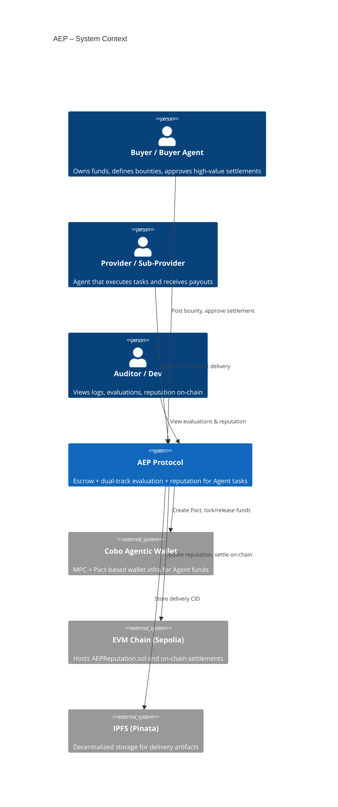
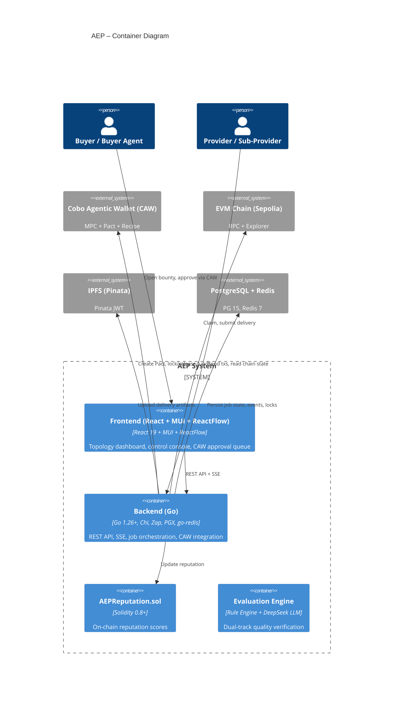
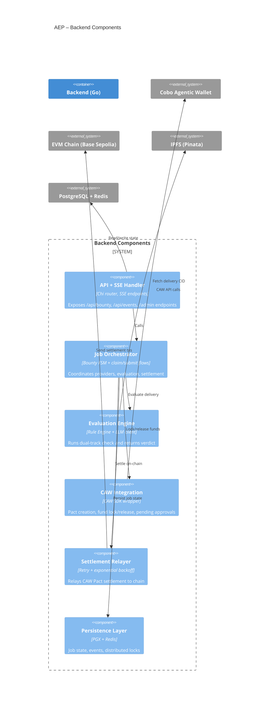

---
# AEP (Agent Escrow Protocol)
A decentralized escrow protocol using **Cobo Agentic Wallet (CAW)** for fund locking and **dual-track AI evaluation** for quality verification.
> ⚠️ **This is a technical protocol demonstration using testnet assets only. No financial services.**  
> All operations use Sepolia ETH (sETH) with no real value.
---
## Track
**Cobo — Agentic Economy × Agentic Wallet**
AEP uses **Cobo Agentic Wallet (CAW)** as its fund management and policy enforcement layer:
- **Pact-based fund locking**: Buyer funds are locked in a Pact, with enforceable spend policies (whitelist, per-tx limit, daily budget).  
- **Dual wallet mode**:  
  - **MPC mode** for buyer wallets: human-in-the-loop via CAW App, no single party can sign alone.  
  - **Custodial mode** for agent-owned Provider wallets: auto-approve within policy, no human pairing needed.  
- **CAW API lifecycle**: wallet creation → Pact → transfer → settlement.
This aligns with Cobo’s official positioning of CAW: **MPC-based self-custodial Agent wallet + Pact human-machine authorization + Recipe-driven skills**.
---
## Architecture (C4-style)
### Level 1 – System Context
Who and what does AEP interact with?

---
### Level 2 – Container Diagram
Main deployable units and their tech stacks.

---
### Level 3 – Component Diagram (Backend)
Key internal components of the AEP Orchestrator.

---
## MVP Flow
```
1. Buyer posts bounty (price + min reputation)
       │
2. AEP Orchestrator assigns Provider
   → Provider can further delegate to Sub-Providers
       │
3. Winner submits delivery → IPFS → CID
       │
4. AEP dual-track evaluation (Scheme D):
   ├─ Rule Engine: non-empty check, field completeness (hard veto)
   └─ LLM: relevance + hallucination → quality score (0–1)
       │
5. CAW Pact settlement → funds released to Provider
       │
6. AEPReputation.sol updated (0–100 scale)
```
**Key safety invariant**: The Evaluator outputs a signal but **never touches funds**. Only CAW Pact Release moves money.
---
## On-Chain Contracts
| Contract | Address (Sepolia) | Explorer |
|----------|-------------------|----------|
| AEPReputation | `0x56286C4E051ba476Fe20E69Aec63d712D9835823` | [View](https://sepolia.etherscan.io/address/0x56286C4E051ba476Fe20E69Aec63d712D9835823) |
**Features:**
- Score range: 0–100  
- Authorized caller (backend) can `updateScore` with delta validation  
- Owner can transfer ownership (zero-address protected)  
- Security: `require(authorizedCallers[caller])`, `require(newScore <= 100)`, delta consistency check  
---
## CAW Wallet Architecture
| Role | Wallet Type | CAW Mode | Notes |
|------|------------|----------|-------|
| Buyer | MPC (paired with CAW App) | Human-in-the-loop | Pact + CAW App approval for high-value flows |
| Provider | Custodial (agent-owned) | Auto-approve within policy | No human pairing; CAW enforces Pact policies |
| Sub-Provider | Custodial / MPC | Configurable | Typically custodial for high-frequency sub-tasks |
Fund flow: **Buyer locks via Pact → Evaluator verifies → Provider receives settlement → Sub-Providers paid downstream**.
---
## Risks & Boundaries
| Risk | Mitigation |
|------|-----------|
| **Using testnet assets** | All operations on Sepolia ETH (sETH) only. No real value at risk. |
| **LLM hallucination approves bad deliveries** | Rule engine has hard veto; LLM is a sampling-only side track |
| **CAW Custodial signing delay on dev** | Dev environment signing service may have pending delays. All API calls succeeded; on-chain broadcast depends on Cobo dev infra. |
| **CAW TSS network latency (MPC mode)** | Custodial mode fallback — no TSS dependency for Provider transfers |
| **Prompt injection alters evaluation parameters** | Evaluator address whitelist; no Admin privileges in Agent sessions |
| **Contract bug locks funds permanently** | Foundry full-coverage tests (20/20 passing) + emergency `claimRefund` bypass |
| **Concurrent claim race funds same job twice** | Redis SETNX (TTL=120s) + PG `SELECT FOR UPDATE` — defense in depth |
| **LLM API unavailable blocks evaluation** | 10s timeout auto-degrades to rule-only engine |
---
## Tech Stack
| Layer | Technology | Purpose |
|-------|-----------|---------|
| Frontend | React 19 + MUI + ReactFlow | Interactive demo panel with topology visualization |
| Backend | Go 1.26+ (Chi, Zap, PGX, go-redis) | REST API, SSE events, provider orchestration |
| Smart Contract | Solidity 0.8+ (Foundry) | AEPReputation.sol (on-chain score + authorized callers) |
| Wallet | Cobo Agentic Wallet (Custodial / MPC) | Fund locking via Pact, settlement via API transfer |
| Storage | IPFS (Pinata) | Decentralized delivery proof storage |
| AI | DeepSeek (LLM) | Semantic evaluation (relevance + hallucination) |
| Database | PostgreSQL 15+ / Redis 7+ | Job state, event persistence, distributed locks |
| Infra | Docker Compose | PostgreSQL + Redis one-command startup |
---
## Quick Start
### Prerequisites
| Tool | Version |
|------|---------|
| Docker / Docker Compose | 29+ |
| Go | 1.22+ |
| Node.js | 22+ |
| Foundry (cast, forge) | 1.7+ |
| PostgreSQL 15+ (via Docker) | — |
| Redis 7+ (via Docker) | — |
### 1. Start Infrastructure
```bash
docker compose up -d
# PostgreSQL :5432, Redis :6379
```
### 2. Configure Environment
```bash
cp conf/.env.example conf/.env
```
Fill in env vars:
- `CAW_API_KEY` / `CAW_WALLET_ID` — Buyer CAW credentials  
- `PROVIDER_CAW_API_KEY` / `PROVIDER_CAW_WALLET_ID` — Provider CAW credentials  
- `PRIVATE_KEY` — Backend gas payment private key (for reputation contract calls)  
- `BASE_SEPOLIA_RPC` — Ethereum Sepolia RPC URL  
- `OPENAI_API_KEY` — DeepSeek/OpenAI API key  
- `PINATA_JWT` — IPFS Pinata JWT  
### 3. Start Backend
```bash
cd backend-go
export $(grep -v '^#' ../conf/.env | xargs)
GONOSUMCHECK=* GONOSUMDB=* go run ./cmd/main.go -config ../conf/config.yaml
```
### 4. Start Frontend
```bash
cd frontend-web
npm install
npm run dev
# Open http://localhost:3000
```
### 5. Run Demo
Open `http://localhost:3000` in browser. The UI guides you through:
1. Create a bounty (sets price, reputation threshold)  
2. Watch agents claim and work on the task  
3. See dual-track evaluation results  
4. Confirm settlement  
5. Verify on-chain reputation update  
---
## Testing
### Contract Tests (Foundry)
```bash
cd contract-foundry
forge test -vvv
# Expected: 20/20 tests passing
# Covers: state machine, reputation RW, permission controls, edge cases
```
### Go Integration Tests
```bash
cd backend-go
go test ./cmd/ -run TestDemo_ -v -count=1 -timeout=120s
# Expected: 10/10 tests passing
# Covers: Happy Path / Fraud Reject / Over-Limit / Timeout Degradation / Concurrent Claim
```
---
## API Reference
### Core Bounty Operations
| Method | Path | Description |
|--------|------|-------------|
| POST | `/api/bounty` | Create bounty (CAW pact lock, includes min_reputation) |
| POST | `/api/bounty/{id}/claim` | Claim bounty (Redis + PG dual lock, reputation check) |
| POST | `/api/bounty/{id}/submit` | Submit delivery (IPFS → Rule → LLM evaluation) |
| POST | `/api/confirm/{jobId}` | Buyer confirms approval, triggers CAW settlement |
| GET | `/api/events` | SSE stream for frontend topology visualization |
| GET | `/api/health` | Health check |
### Admin
| Method | Path | Description |
|--------|------|-------------|
| POST | `/admin/retry/{jobId}` | Admin retry settlement (requires Admin Token) |
| GET | `/admin/jobs` | List all jobs with status |
---
## CAW Integration Notes
### Key API Flow
```
POST /principals/provision          → Create API key
POST /wallets                       → Create wallet (Custodial or MPC)
POST /wallets/{id}/addresses        → Create on-chain address
POST /faucet/deposit                → Request testnet tokens
GET  /wallets/balances?force_refresh → Sync on-chain balance
POST /pacts/submit                  → Create pact (delegation agreement)
POST /wallets/{id}/transfer         → Submit transfer (requires pact temp API key)
caw pending approve                 → Approve pending operation
```
### Known Limitations
- **Custodial wallet signing on dev environment**: After approval, the transaction may remain at `PendingSign` status if the Cobo dev signing service has a backlog. The entire CAW API flow (provision → wallet → pact → transfer → approve) completes successfully; only the final on-chain broadcast depends on Cobo's backend.  
- **MPC wallet pairing on WSL**: TSS Node WebSocket connections are unstable on WSL2 due to Hyper-V NAT. MPC pairing is only reliable on native Linux/Mac.  
- **Testnet faucet rate limits**: 0.01 SETH per deposit, 0.02 daily limit.
---
## Project Structure
```
AEP-Hackathon/
├── backend-go/           # Go backend
│   ├── api/             # HTTP routes + SSE handler
│   ├── cmd/             # main.go + demo_test.go
│   ├── config/          # Viper config loader
│   ├── store/           # PostgreSQL + Redis persistence
│   ├── providers/       # CAW / IPFS / DeepSeek external service wrappers
│   ├── engine/          # Rule engine + LLM evaluation orchestrator
│   └── relayer/         # CAW settlement retry with exponential backoff
├── contract-foundry/     # Solidity contracts
│   ├── src/             # AEPReputation.sol
│   └── test/            # AEPReputation.t.sol (20 tests)
├── frontend-web/         # React + MUI + ReactFlow frontend
│   └── src/             # App.jsx, topology visualization, step wizard
├── conf/                # Configuration files
│   └── .env             # Runtime secrets (excluded from VCS)
├── docs/                # PRD, design doc, demo scripts
├── scripts/             # DB schema, data export tools
├── Demo-Record/         # Demo screen recordings
├── docker-compose.yml   # PostgreSQL 15 + Redis 7
└── README.md            # This file
```
---
## Key Security Guarantees
1. **BuyerApproval**: Must be `true` before any settlement — AI cannot spend money alone  
2. **Redis Lock**: SETNX TTL=120s + `defer Del()` + PG `SELECT FOR UPDATE` — defense in depth  
3. **LLM Degradation**: 10s timeout → fall back to rule engine — no single point of failure  
4. **Event Dedup**: L1 (Redis 24h) + L2 (PG PK) — no duplicate settlement  
5. **Network Retry**: Max 3 attempts, exponential backoff 1s base — resilience  
6. **Reputation Update**: Signed by backend private key, delta-verified on-chain  

---

## Project Status

Completed for Cobo Track Hackathon (2026-06-13):

| Area | Status |
|------|--------|
| ✅ CAW Pact fund locking & release (MPC + Custodial) | Done |
| ✅ Dual-track evaluation (Rule Engine + DeepSeek LLM) | Done |
| ✅ Provider→SubProvider auto-settlement via Pact | Done |
| ✅ AEPReputation.sol deployed & verified on Sepolia | [`0x56286C4E05...`](https://sepolia.etherscan.io/address/0x56286C4E051ba476Fe20E69Aec63d712D9835823) |
| ✅ On-chain reputation read/write with delta validation | Done |
| ✅ Topology visualization (7-node ReactFlow graph) | Done |
| ✅ SSE + HTTP polling dual-channel logging | Done |
| ✅ 8 screenshots + verification report with all tx hashes | Done |
| ✅ On-chain transactions: Buyer→Provider, Provider→SubProvider, reputation updates | All on Etherscan |

**Demo video** — recording in progress.

### Future Plans (Post-Hackathon)

| Feature | Priority | Notes |
|---------|----------|-------|
| 📹 Demo video production | Immediate | 3-5 min walkthrough following demo script |
| 🎨 UI polish | High | Dark theme refinement, responsive layout |
| 🌐 Public deployment | Medium | Docker Compose on VPS with public URL |
| 🔐 Mainnet readiness | Medium | Production CAW API, real ETH gas |
| 🧪 Multi-bounty concurrent test | Low | Scale test with 10+ concurrent bounties |
| 📊 Reputation dashboard | Low | Historical trend chart, agent comparison |

---
## License
MIT

